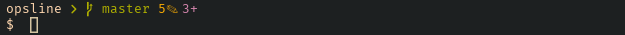

# opsline

`opsline` is a powerline style prompt for your shell, inspired by 
[powerline-go](https://github.com/justjanne/powerline-go).



## Install

```
cargo install --path .
```

Make sure `~/.cargo/bin` is in your `PATH`


### Bash

Add the following to your `.bashrc` :

```
function _update_ps1() {
    PS1="$(opsline --shell bash --theme gruvbox --segments cwd,git,root)"
}

if [ "$TERM" != "linux" ] && command -v opsline 2>&1 >/dev/null; then
    PROMPT_COMMAND="_update_ps1; $PROMPT_COMMAND"
fi
```

### Zsh

Add the following to your `.zshrc` :

```
function _update_ps1() {
    PS1="$(opsline --shell zsh --theme gruvbox --segments cwd,git,root)"
}

if [ "$TERM" != "linux" ] && command -v opsline 2>&1 >/dev/null; then
    precmd_functions+=(_update_ps1)
fi
```

## Configuration

Opsline now command-line arguments. Here are the available options:

```bash
Usage: opsline [OPTIONS] --shell <SHELL>

Options:
      --shell <SHELL>
          [possible values: bash, zsh]
      --theme <THEME>
          [default: default] [possible values: default, gruvbox]
      --segments <SEGMENTS>
          [default: cwd,root]
      --cwd-dironly

      --kube-critical-contexts <KUBE_CRITICAL_CONTEXTS>

      --kube-context-aliases <KUBE_CONTEXT_ALIASES>

      --containers-url <CONTAINERS_URL>

      --terraform-critical-workspaces <TERRAFORM_CRITICAL_WORKSPACES>

  -h, --help
          Print help
  -V, --version
          Print version
```

### Example

```bash
opsline --shell bash --theme gruvbox --segments cwd,git,root --cwd-dironly
```

### Advanced Example

```bash
opsline --shell bash \
  --theme gruvbox \
  --segments cwd,readonly,git,kube,containers,root \
  --cwd-dironly \
  --kube-critical-contexts k8s-prod \
  --kube-context-aliases "k8s-prod:prod,minikube:dev" \
  --containers-url "unix:/run/user/1000/podman/podman.sock" \
  --terraform-critical-workspaces prod
```

## Documentation

[Bash tips: Colors and formatting (ANSI/VT100 Control sequences)](https://misc.flogisoft.com/bash/tip_colors_and_formatting)

[Nerd Fonts](https://www.nerdfonts.com/)
